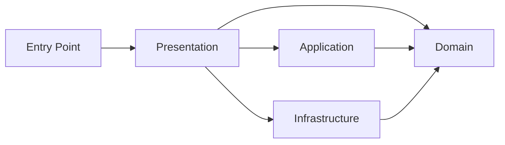

# Clean Architecture Template for FastAPI Applications


[](https://github.com/copier-org/copier)


This template provides a clean and well-structured foundation for building FastAPI applications using Clean Architecture principles. It uses **SQLModel** as the ORM and **PostgreSQL** as the database. It clearly separates business logic, use cases, infrastructure, and the API layer to ensure maintainability, testability, and scalability. With an explicit project structure and built-in testing strategy, it serves as a solid starting point for developing professional and production-ready backends.

## Requirements
- Python 3.10 or higher
- PostgreSQL 
- [uv](https://docs.astral.sh/uv/getting-started/installation/) for managing virtual environments and dependencies
- [justfile](https://just.systems/man/en/packages.html) for command runner

## Todo

- [x] Setup project structure
- [x] Create database models and implement database connection
- [x] Test with real database (e.g., PostgreSQL, MySQL)
- [ ] Test on real project
- [ ] Implement end-to-end tests setup
- [ ] Implement integration tests setup

## Setup

1. Create project with 
   ```bash
   uvx create-clean-archi-fastapi
   ```
3. Navigate to the project directory:
4. Install dependencies:
   ```bash
   uv sync
   ```  
5. Run the application:
   ```bash
   just start
    ```

## Flow



## Project Structure

```
.
├── justfile
├── main.py -------------- --- Entry point of the application
├── pyproject.toml ------- --- Project configuration and dependencies
├── README.md ------------ --- This file
├── src/
│   ├── application/
│   │   ├── interface/ ---- --- Contains interfaces for repositories, services, etc.
│   │   └── use_case/ ----- --- Contains application use cases (1 file per use case)
│   ├── config.py
│   ├── domain/
│   │   ├── entities/ ----- --- Contains domain entities
│   │   ├── exceptions/ --- --- Contains custom exceptions for the domain
│   │   └── value_objects/  --- Contains value objects for the domain
│   ├── infrastructure/ --- --- Contains implementations of interfaces defined in the application layer
│   │   └── database/ ----- --- Contains database connection and models
│   │   │   ├── database.py --- Contains database connection and session management
│   │   │   ├── interface.py -- Contains database interface definitions
│   │   │   ├── models/ --- --- Contains database models 
│   │   │   └── seed/ ----- --- Contains database seeding scripts
│   └── presentation/ ----- --- Contains FastAPI application and API routes
│       ├── app.py -------- --- Contains FastAPI application setup
│       ├── core/ --------- --- Contains core components like error_handling, middleware, etc.
│       ├── deps/ --------- --- Contains dependency injection components
│       ├── routes/ ------- --- Contains API route definitions
│       └── schemas/ ------ --- Contains Pydantic schemas for request and response validation
├── tests/ 
│   ├── clean/ ------------ --- Contains tests for clean architecture dependency rules
│   ├── conftest.py ------- --- Contains fixtures for tests
│   ├── e2e/ -------------- --- Contains end-to-end tests (in progress)
│   ├── integration/ ------ --- Contains integration tests (in progress)
│   ├── unit/ ------------- --- Contains unit tests for application logic
│   └── utils.py ---------- --- Contains utility functions for tests
└── uv.lock

```

## Testing 

To run tests, use the following command:

- Run unit tests:
   ```bash
   just test-unit
   ```
- Run tests with coverage:
   ```bash
   just test-coverage
   ``` 
- Run test for clean architecture dependency rules:
   ```bash
   just test-clean
   ```